# 🏦 Customer 360 Bancario
### Plataforma Inteligente para Segmentación, Riesgo y Rentabilidad de Clientes Bancarios

Proyecto de análisis de datos orientado a centralizar la información de clientes bancarios dispersa en múltiples sistemas, segmentarlos según su comportamiento financiero, estimar su riesgo crediticio y predecir el abandono mediante Python, SQL, Machine Learning y Power BI.

---

## 📌 Tabla de contenidos

- [Descripción del proyecto](#descripción-del-proyecto)
- [Objetivos](#objetivos)
- [Dataset](#dataset)
- [Modelo de datos](#modelo-de-datos)
- [Arquitectura del proyecto](#arquitectura-del-proyecto)
- [Herramientas utilizadas](#herramientas-utilizadas)
- [Proceso de análisis](#proceso-de-análisis)
- [Modelos de Machine Learning](#modelos-de-machine-learning)
- [Dashboard](#dashboard)
- [Resultados principales](#resultados-principales)
- [Recomendaciones de negocio](#recomendaciones-de-negocio)
- [Limitaciones conocidas](#limitaciones-conocidas)
- [Instalación y ejecución](#instalación-y-ejecución)
- [Conocimientos aplicados](#conocimientos-aplicados)
- [Autor](#autor)

---

## 📝 Descripción del proyecto

Un banco cuenta con miles de clientes que realizan transacciones, solicitan créditos, utilizan tarjetas y contratan seguros. La información se encontraba distribuida en diferentes sistemas, dificultando responder preguntas estratégicas sobre rentabilidad, riesgo y fidelización.

Este proyecto construye una plataforma analítica completa que cubre el ciclo íntegro de un proyecto de datos: desde el entendimiento del negocio y diseño de base de datos, hasta modelos de Machine Learning y un dashboard ejecutivo interactivo en Power BI con enfoque predictivo y prescriptivo.

---

## 🎯 Objetivos

- Centralizar la información de clientes y productos en una base de datos relacional PostgreSQL.
- Analizar el comportamiento financiero mediante KPIs descriptivos y predictivos.
- Identificar segmentos de clientes utilizando técnicas RFM + K-Means.
- Estimar la probabilidad individual de abandono (churn) por cliente.
- Estimar el riesgo crediticio e identificar el monto en riesgo latente en la cartera vigente.
- Aproximar la rentabilidad por cliente y por producto ajustada por costo de fondeo.
- Construir un dashboard ejecutivo en Power BI conectado directamente a los modelos de ML.
- Generar recomendaciones de negocio accionables con impacto económico estimado.

---

## 🗂️ Dataset

### Fuente de datos

Los datos son sintéticos, generados con Python para fines de portafolio. La generación incluye:
- Distribuciones log-normal para ingresos y montos (comportamiento realista)
- Estacionalidad en transacciones (mayor volumen en noviembre y diciembre)
- Anomalías controladas en el 2% de transacciones
- Perfiles de riesgo (alto, medio, bajo) para simular comportamiento de pago real

### Volumen de datos generados

| Tabla | Registros |
|-------|-----------|
| Clientes | 5,000 |
| Cuentas | 8,244 |
| Tarjetas | 6,166 |
| Préstamos | 4,456 |
| Pagos | 345,888 |
| Transacciones | 148,212 |
| Seguros | 3,258 |

---

## 🗄️ Modelo de datos

El proyecto implementa dos modelos de datos complementarios:

### Modelo A — Base Relacional Normalizada (OLTP)
10 tablas: Cliente, Cuenta, Tarjeta, Préstamo, Pago, Transacción, Seguro, Producto, Canal, Agencia.

### Modelo B — Esquema Estrella (Data Warehouse)
- **5 dimensiones:** Dim_Cliente, Dim_Fecha, Dim_Producto, Dim_Canal, Dim_Agencia
- **4 tablas de hechos:** Fact_Transacciones, Fact_Prestamos, Fact_Pagos, Fact_Productos_Contratados

---

## 🏗️ Arquitectura del proyecto

```
customer360/
│
├── data/                          # CSVs de respaldo del Data Warehouse
│   ├── dim_cliente.csv
│   ├── dim_fecha.csv
│   ├── dim_producto.csv
│   ├── dim_canal.csv
│   ├── dim_agencia.csv
│   ├── fact_transacciones.csv
│   ├── fact_prestamos.csv
│   ├── fact_pagos.csv
│   └── fact_productos_contratados.csv
│
├── sql/
│   └── modelo_a/
│       ├── fase3_modelo_A.sql     # Creación del esquema OLTP
│       └── fase3_datos_base.sql   # Datos base (canales, agencias, productos)
│
├── notebooks/
│   ├── fase5_eda.ipynb            # Análisis Exploratorio de Datos
│   ├── fase6_modelos.ipynb        # Modelos de Machine Learning
│   └── exportar_datos.ipynb       # Exportación de datos a CSV
│
├── src/
│   ├── config.py                  # Configuración de conexión a PostgreSQL
│   ├── generador.py               # Generación de datos sintéticos
│   ├── etl.py                     # ETL: Modelo A → Modelo B
│   └── consultas.py               # Consultas SQL analíticas
│
├── dashboard/
│   └── Customer360_Dashboard.pbix # Dashboard ejecutivo Power BI
│
├── images/                        # Capturas del proyecto
│
├── reports/
│   ├── Fase1_Entendimiento_Negocio.pdf
│   └── Fase2_Diccionario_Reglas_Negocio.pdf
│
├── README.md
└── requirements.txt
```

---

## 🛠️ Herramientas utilizadas

| Categoría | Herramienta |
|-----------|-------------|
| Lenguaje | Python 3.14 |
| Base de datos | PostgreSQL 18 |
| ETL y generación de datos | Pandas, NumPy, Psycopg2, SQLAlchemy, Faker |
| Machine Learning | Scikit-learn (K-Means, Regresión Logística, Random Forest) |
| Visualización | Matplotlib, Seaborn, Power BI Desktop |
| Control de versiones | Git, GitHub |
| Editor | VS Code |

---

## 🔎 Proceso de análisis

### Fase 1 — Entendimiento del negocio
Definición de stakeholders, preguntas de negocio y KPIs del dashboard ejecutivo. Se estableció el enfoque predictivo y prescriptivo del proyecto, transitando de un análisis descriptivo (qué pasó) a uno predictivo (qué va a pasar) y prescriptivo (qué hacer).

### Fase 2 — Diseño de base de datos
Documentación del diccionario de datos completo para el Modelo A (OLTP) y el Modelo B (Data Warehouse), junto con 20 reglas de negocio. Se definió la incumplimiento crediticio como mora > 90 días (criterio Basilea simplificado).

### Fase 3 — ETL y datos sintéticos
Generación de datos sintéticos en Python con distribuciones estadísticas realistas. Construcción del proceso ETL en dos pasadas: carga inicial con campos ML en NULL y actualización post-modelado.

### Fase 4 — Consultas SQL analíticas
Respuesta a 7 preguntas de negocio directamente desde el Data Warehouse incluyendo top clientes por rentabilidad, índice de morosidad por ciudad, monto en riesgo latente y oportunidades de cross-selling.

### Fase 5 — EDA e ingeniería de variables

Se analizaron distribuciones, correlaciones y comportamientos clave:

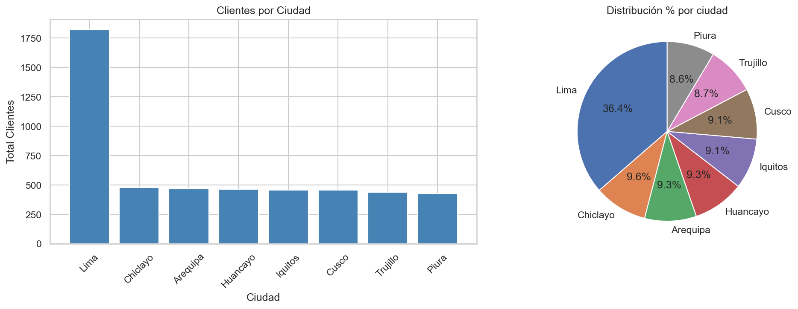

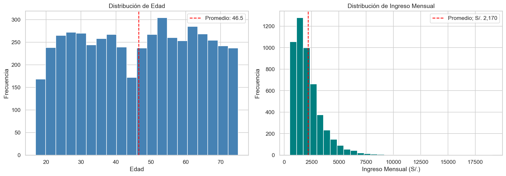

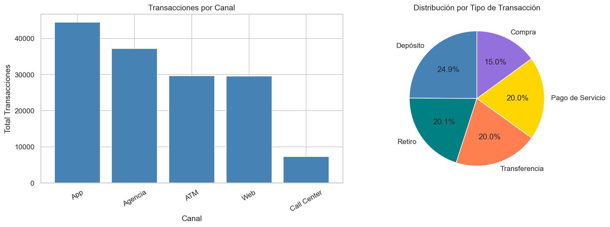

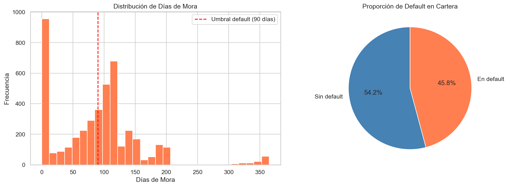

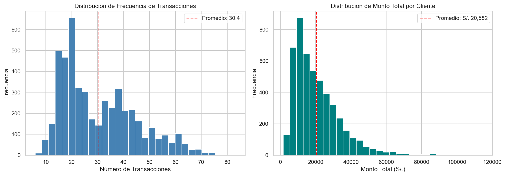

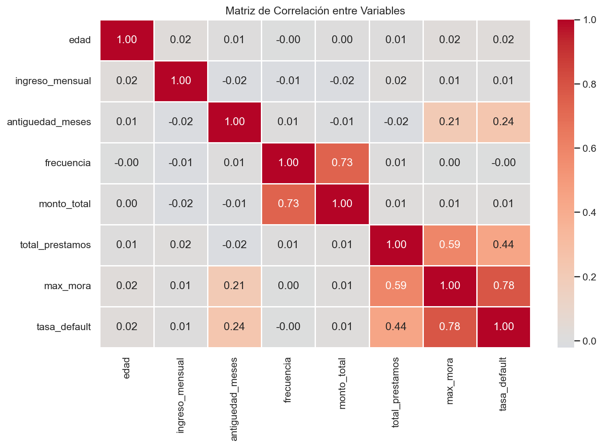

---

## 🤖 Modelos de Machine Learning

### Modelo 1 — Segmentación RFM + K-Means

Se aplicó el método del codo para determinar K=4 como número óptimo de clusters.

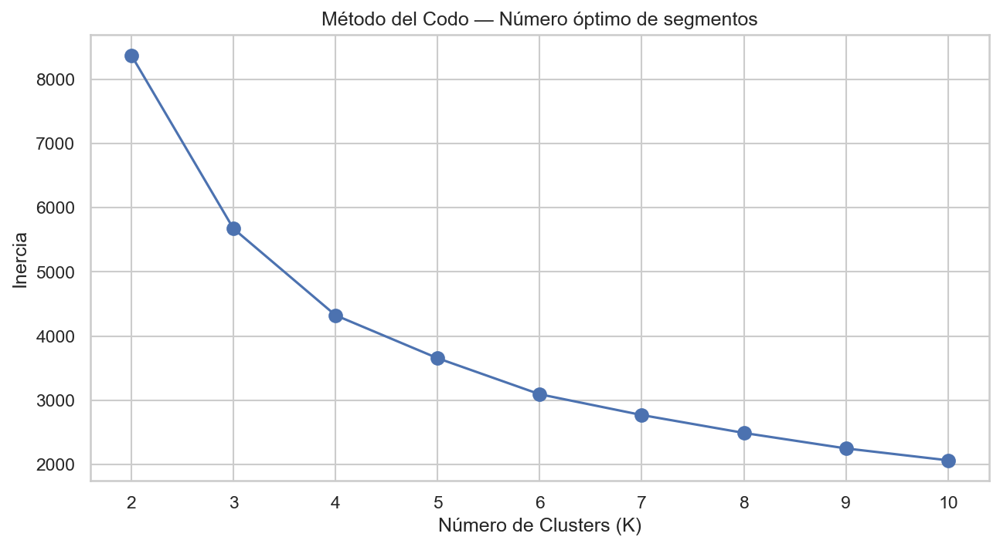

Los 4 segmentos identificados:

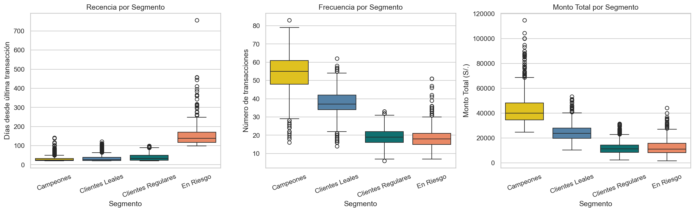

| Segmento | Clientes | Recencia Prom. | Frecuencia Prom. | Monto Prom. |
|----------|----------|----------------|-----------------|-------------|
| Campeones | 718 | 15 días | 54 transacciones | S/. 43,498 |
| Clientes Leales | 1,589 | 18 días | 38 transacciones | S/. 24,292 |
| Clientes Regulares | 2,164 | 24 días | 19 transacciones | S/. 11,691 |
| En Riesgo | 397 | 140 días | 19 transacciones | S/. 12,756 |

### Modelo 2 — Riesgo Crediticio

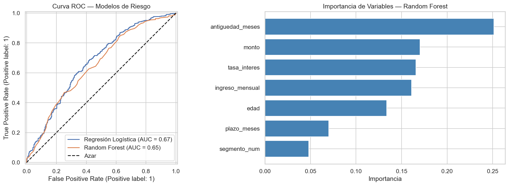

| Modelo | ROC-AUC | Recall Default |
|--------|---------|----------------|
| Regresión Logística | 0.69 | 72% |
| Random Forest | 0.65 | 76% |

**Variables más importantes:** antigüedad_meses, monto, tasa_interes, ingreso_mensual

### Modelo 3 — Churn

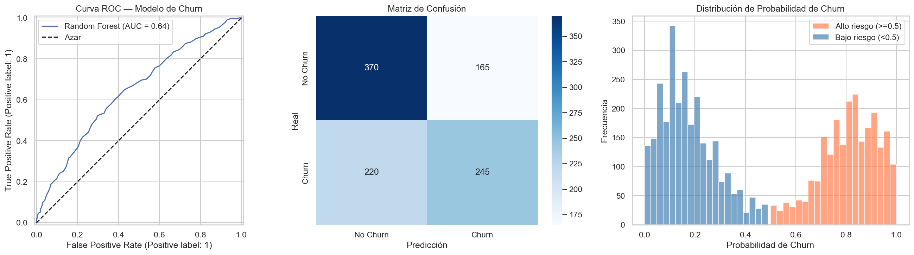

| Métrica | Valor |
|---------|-------|
| ROC-AUC | 0.69 |
| Precisión (churn) | 58% |
| Recall (churn) | 37% |

**Variables más importantes:** ingreso_mensual, antigüedad_meses, edad

---

## 📊 Dashboard

El dashboard ejecutivo en Power BI está organizado en 3 páginas interactivas con filtros por ciudad y segmento RFM.

### Resumen Ejecutivo
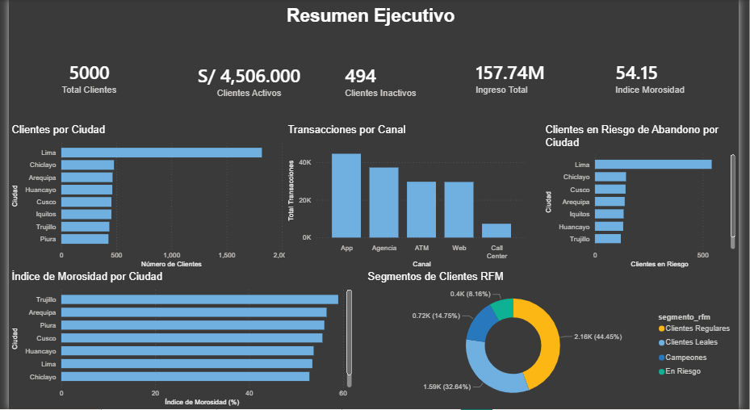

### Riesgo y Rentabilidad
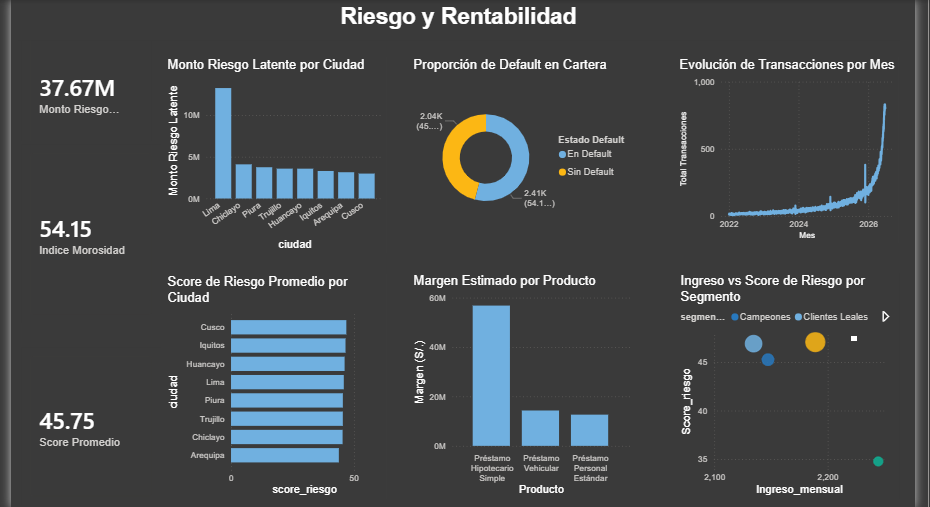

### Fidelización y Churn
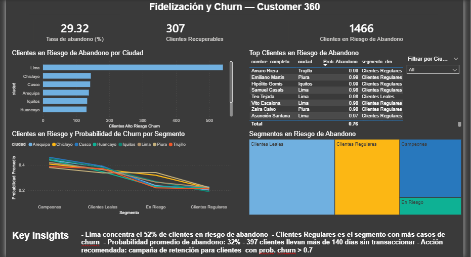

---

## 📈 Resultados principales

- **Lima** concentra el mayor volumen con 2,000 clientes y S/. 13.2 M en riesgo latente.
- **Piura** tiene el mayor porcentaje de riesgo latente con 58.07% de su cartera en zona de peligro.
- **App** es el canal más utilizado con 44,000 transacciones, seguido de Agencia con 37,000.
- El **54.15%** de los préstamos presenta mora mayor a 90 días.
- El segmento **Campeones** genera un monto promedio de S/. 43,498 por cliente.
- **397 clientes** llevan más de 140 días sin transaccionar.
- El **Préstamo Hipotecario Simple** genera el mayor margen estimado con S/. 60 M.
- La tasa de abandono estimada es **29.32%** con 1,000 clientes en alto riesgo.

---

## 💡 Recomendaciones de negocio

- **Campaña de retención urgente:** Dirigir campañas personalizadas a los 397 clientes del segmento "En Riesgo" con más de 140 días sin transaccionar. El modelo de churn permite priorizar por probabilidad individual y canal preferido.
- **Cross-selling para Clientes Regulares:** Los 2,164 clientes regulares tienen menos de 2 productos activos en promedio. Ofrecerles un producto adicional puede incrementar el ingreso por cliente significativamente.
- **Política de crédito preventiva en Piura:** Piura tiene el mayor porcentaje de riesgo latente (58.07%). Se recomienda revisar las políticas de otorgamiento de crédito en esa ciudad antes de que la mora se materialice.
- **Fortalecer canales digitales:** App y Web concentran el 50% de las transacciones. Invertir en la experiencia digital puede incrementar la frecuencia de uso y reducir el churn.
- **Programa VIP para Campeones:** Los 718 clientes Campeones generan el mayor valor por cliente. Un programa de fidelización exclusivo puede proteger ese ingreso y reducir su riesgo de abandono.

---

## ⚠️ Limitaciones conocidas

- Los datos son sintéticos generados para fines de portafolio; los resultados son ilustrativos y no constituyen proyecciones operativas.
- El ROC-AUC no supera 0.80 debido a la naturaleza de los datos sintéticos con ruido aleatorio.
- No se implementa SCD (Slowly Changing Dimensions) en el Data Warehouse; cambios en atributos como ciudad o ingreso sobreescriben el historial.
- El ETL requiere dos pasadas: carga inicial con score_riesgo y segmento_rfm en NULL, y actualización post-modelado.
- El margen_estimado es una aproximación simplificada y no incluye pérdida esperada (PD × LGD × EAD) ni costos operativos.

---

## ⚙️ Instalación y ejecución

### 1. Prerrequisitos
- PostgreSQL 18
- Python 3.14
- Power BI Desktop

### 2. Clonar repositorio
```bash
git clone https://github.com/tu_usuario/customer360-bancario.git
cd customer360-bancario
```

### 3. Instalar dependencias
```bash
pip install -r requirements.txt
```

### 4. Configurar conexión
Edita `src/config.py` con tus credenciales de PostgreSQL:
```python
DB_CONFIG = {
    "host": "localhost",
    "port": 5432,
    "database": "customer360",
    "user": "postgres",
    "password": "tu_password"
}
```

### 5. Crear base de datos y esquema
Ejecuta en pgAdmin en este orden:
```
sql/modelo_a/fase3_modelo_A.sql
sql/modelo_a/fase3_datos_base.sql
```

### 6. Generar datos sintéticos
```bash
cd src
python generador.py
```

### 7. Ejecutar ETL
```bash
python etl.py
```

### 8. Ejecutar análisis y modelos
```bash
jupyter notebook
```
Ejecutar en orden:
1. `notebooks/fase5_eda.ipynb`
2. `notebooks/fase6_modelos.ipynb`

### 9. Abrir dashboard
Abre `dashboard/Customer360_Dashboard.pbix` en Power BI Desktop y conecta a tu instancia local de PostgreSQL.

---

## 📚 Conocimientos aplicados

- Diseño de base de datos relacional (OLTP) y Data Warehouse (esquema estrella)
- Generación de datos sintéticos con distribuciones estadísticas realistas
- Proceso ETL completo en Python con inserción por lotes
- Consultas SQL analíticas avanzadas (JOINs, GROUP BY, CASE WHEN, HAVING, COALESCE)
- Análisis Exploratorio de Datos (EDA)
- Ingeniería de variables (Feature Engineering)
- Segmentación RFM y método del codo
- Clustering no supervisado con K-Means
- Clasificación supervisada con Regresión Logística y Random Forest
- Evaluación de modelos (ROC-AUC, Precisión, Recall, Matriz de Confusión)
- Dashboard ejecutivo en Power BI con medidas DAX
- Business Intelligence y KPIs ejecutivos
- Detección y corrección de data leakage

---

## 👤 Autor

**Cesar Alexander Macalopu Torres**
Data Analyst | Python | SQL | Power BI | Machine Learning

GitHub: [tu_usuario](https://github.com/tu_usuario)